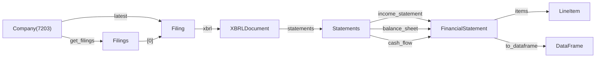
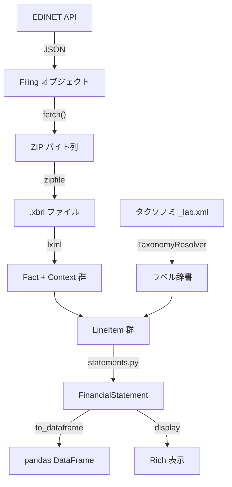

# EDINET Python ライブラリ 開発計画

## 1. プロジェクトの背景と目的

### なぜ作るのか

- 日本の EDINET（金融庁の電子開示システム）には、米国の `edgartools`（1.7k stars）や韓国の `dart-fss`（350 stars）に相当する「決定版」Python ライブラリが存在しない
- 既存の `edinet-tools`（24 stars, v0.2.0）は致命的な欠陥を抱えており、実用に耐えない（後述）
- 特に **XBRL 財務諸表の構造化解析**（タクソノミ統合、ラベル解決）は日本語圏で誰もやっていない空白地帯

### 設計思想

- `edgartools` のアプローチを採用: **オブジェクト指向**（Pydantic）で財務データにアクセスし、必要に応じて `.to_dataframe()` で pandas 変換
- `dart-fss` のアプローチ（最初から DataFrame を返す）は採用しない
- LLM（RAG）との親和性を重視: JSON/Object として構造を保持することで、AI に決算データを食わせるコネクタとしても機能する

### ゴール（春休み終了時点）

```python
from edinet import Company

toyota = Company("7203")
filing = toyota.latest("有価証券報告書")
pl = filing.xbrl().statements.income_statement()

print(pl)              # Rich でコンソールに表示
df = pl.to_dataframe() # pandas DataFrame に変換
```

「トヨタの最新有報から損益計算書をオブジェクトとして取得し、表示し、DataFrame に変換する」が動くこと。

**v0.1.0 のスコープ制限:**
- 対象: **J-GAAP の一般事業会社**（製造業、小売業、サービス業等）のみ
- 対象外（v0.2.0 以降）:
  - **金融機関**（銀行・保険・証券）— PL の構造が全く異なる（「売上高」ではなく「経常収益」等）
  - **IFRS 適用企業** — 名前空間が `jppfs_cor` → `ifrs-full` に変わり、科目体系が異なる
  - **US-GAAP 適用企業** — 同上
- この制限を明記することで、Day 15 の Statement 組み立てで「全企業に対応しなければ」と沼ることを防ぐ

---

## 2. 競合分析

### edgartools（米国、参考にすべきライブラリ）

- GitHub: dgunning/edgartools, 1.7k stars
- 設計: Pydantic + オブジェクト指向、Company -> Filing -> XBRL -> Statement の階層
- 技術スタック: httpx, lxml, pydantic, rich（Arelle 不使用）
- 強み: XBRL 解析が深い（`xbrl/` モジュールに statements, facts, dimensions, standardization, stitching 等）

#### edgartools のディレクトリ構造（参考）

```
edgar/
  entity/           # Company, Entity 等のドメインモデル
  xbrl/             # XBRL 解析（最も価値が高い部分）
    core.py
    facts.py         # Fact の抽出と正規化
    statements.py    # Fact群 → 財務諸表への組み立て
    dimensions.py    # ディメンション（セグメント情報）
    periods.py       # 期間処理
    presentation.py  # 表示レイアウト
    rendering.py     # Rich 表示
    standardization/ # 勘定科目の標準化
    stitching/       # 複数期間のデータ結合
    models.py        # データモデル
  _filings.py       # Filing モデル
  core.py
  httpclient.py
  financials.py
  ...
```

#### edgartools から盗むべき3つの設計パターン

1. **オブジェクト階層**: `Company -> EntityFilings -> EntityFiling -> XBRL -> Statements -> Statement`
2. **Fact が全ての基本単位**: 個々の数値データを Fact オブジェクトとして表現し、文脈（期間、単位、ディメンション）を結合
3. **遅延評価（Lazy Loading）**: `Company("AAPL")` の時点では最小限の通信。`.get_filings()` や `.xbrl()` を呼んで初めてデータ取得

### edinet-tools（日本、致命的欠陥あり）

- GitHub: matthelmer/edinet-tools, 24 stars, v0.2.0 (2026-01-26)
- 設計: Pydantic ベース、entity/document/parser の構造
- **総合評価: 5/10 — 実用に耐えられないレベル**

#### edinet-tools の致命的問題一覧

**P0: データファイルが存在しない**

- `EntityClassifier` が必要とする CSV ファイルが `.gitignore` で除外されリポジトリに不在
- `import edinet_tools` → `entity("7203")` で `FileNotFoundError`

**P0: 型式定義の致命的欠陥**

- `config.py` から 6 型式が欠落: 240（公開買付届出書）, 260（公開買付報告書）, 270（公開買付撤回届出書）, 290（意見表明報告書）, 310（対質問回答報告書）, 330（別途買付禁止特例申出書）
- `doc_types.py` で名称が誤り: 030 を「公開買付届出書」と誤記（実際は「有価証券届出書」）
- `filter_documents()` が未登録型式をサイレントに除外 → M&A 関連書類が消失

**P0: 2つの重複パイプライン**

- 旧系統: `data.py` + `data_loader.py` + `processors.py` + `parser.py`
- 新系統: `entity_classifier.py` + `entity.py` + `parsers/`
- 両者はデータを共有せず、カバー範囲も食い違い

**P1: HTTP の堅牢性欠如**

- `urllib.request.urlopen()` にタイムアウトなし → 無限ハング
- レート制限なし → API ban リスク
- `Entity.documents(days=30)` が 30 回逐次 API 呼び出し

**P1: 依存関係の問題**

- `llm` がコア依存（オプション機能でしか使わないのに必須）
- `pandas` も同様に必須
- `import` 時に `load_dotenv()` + `logging.warning()` を実行（副作用）

**P1: コード品質**

- ミュータブルなデフォルト引数（`def func(x=[])`）
- bare except 句（`SystemExit`, `KeyboardInterrupt` まで捕捉）
- `pyproject.toml` と `pytest.ini` の不整合

**パーサーカバレッジ: 5/41 型式 = 12.2%**

- 専用パーサー: 120, 140, 160, 180, 350 の 5 種のみ
- 訂正報告書（130, 150, 170, 190, 360）に専用パーサーなし
- XBRL 財務諸表の構造化解析（タクソノミ統合）は未実装

### dart-fss（韓国、参考情報）

- 設計: Arelle 依存、DataFrame 一発変換
- 強み: タクソノミ統合が完全自動、`samsung.extract_fs()` で財務諸表 DataFrame が即座に返る
- 弱み: Arelle 依存で重い、インストールが大変

---

## 3. アーキテクチャ設計

### プロジェクト構造

```
edinet/
  pyproject.toml
  src/
    edinet/
      __init__.py          # 公開API: Company, Filing, configure
      _config.py           # 設定管理（副作用なし）
      _http.py             # HTTP クライアント（タイムアウト、リトライ、レート制限）
      models/              # Pydantic モデル
        __init__.py
        company.py         # Company
        filing.py          # Filing, Filings
        doc_types.py       # 全41型式の Enum 定義
        financial.py       # FinancialStatement, LineItem, Fact, Period
      api/                 # EDINET API v2 ラッパー
        __init__.py
        documents.py       # 書類一覧 API
        download.py        # 書類取得 API（ZIP）
      xbrl/                # XBRL 解析
        __init__.py
        parser.py          # XBRL インスタンス文書のパース
        taxonomy.py        # タクソノミリゾルバー（核心）
        facts.py           # Fact の抽出と正規化
        statements.py      # Fact 群 → 財務諸表オブジェクトへの組み立て
        periods.py         # 期間の正規化・比較
      display/             # 表示
        __init__.py
        rich.py            # Rich によるコンソール表示
  tests/
    conftest.py
    test_models/
      test_doc_types.py
      test_company.py
    test_api/
      test_integration.py  # Large テスト（ネットワーク必要）
    test_xbrl/
      test_parser.py
      test_taxonomy.py
      test_facts.py
      test_statements.py
    fixtures/
      taxonomy_mini/       # タクソノミの最小サブセット（Git 管理する）
      xbrl_fragments/      # 手書きの小さな XBRL ファイル
  examples/
    toyota_pl.py           # デモスクリプト
  docs/
    PLAN.LIVING.md         # この文書（実行中に更新する版）
```

### オブジェクトグラフ



### データフロー



### 技術スタック

```
必須依存:
  pydantic >= 2.0     # データモデル
  httpx >= 0.27       # HTTP クライアント（同期/非同期両対応）
  lxml >= 5.0         # XML パース（内部は C の libxml2）
  platformdirs >= 4.0 # OS標準キャッシュディレクトリの解決（純Python、サブ依存ゼロ）

オプション依存 (extras):
  pandas >= 2.0       # [analysis] .to_dataframe() 用
  rich >= 13.0        # [display] コンソール表示用

不使用:
  arelle              # 重すぎる。lxml + 自前ロジックで代替
  requests            # async 非対応。httpx を使う
  beautifulsoup4      # lxml で十分
```

---

## 4. クラス定義の詳細

### edgartools との差分

#### Company

```python
# edgartools (米国)
class Company(Entity):
    cik: str              # SEC 固有 ID
    tickers: list[str]    # ["AAPL"]
    exchanges: list[str]  # ["Nasdaq"]

# あなたの版 (日本)
class Company(BaseModel):
    edinet_code: str      # "E02144" (EDINET 固有 ID)
    sec_code: str | None  # "72030" (証券コード + チェックディジット)
    ticker: str | None    # "7203" (証券コード 4桁)
    name_ja: str          # "トヨタ自動車株式会社"
    name_en: str | None   # "TOYOTA MOTOR CORPORATION"
    accounting_standard: str | None  # "J-GAAP" / "IFRS" / "US-GAAP"
```

差分ポイント:

- 日本は `edinet_code` が主キー（米国の `cik` に相当）
- 日本には「証券コード」（4桁）がある
- 日本企業は会計基準が3種類（J-GAAP / IFRS / US-GAAP）

#### Filing

```python
# あなたの版 (日本)
class Filing(BaseModel):
    doc_id: str              # "S100XXXX" (EDINET 書類管理番号)
    doc_type_code: str       # "120"
    doc_type: DocType        # DocType.SECURITIES_REPORT
    doc_description: str     # "有価証券報告書 第85期..."
    filing_date: date
    period_start: date | None
    period_end: date | None
    company: Company
```

差分ポイント:

- 日本は `doc_id` (S始まり)、米国は `accession_number` (ハイフン区切り)
- EDINET API は `period_start` / `period_end` を返す（米国は自前パースが必要）

#### FinancialStatement / LineItem

```python
class LabelInfo(BaseModel):
    """ラベルのトレース情報（どのラベルを、なぜ選んだか）"""
    text: str           # "売上高"
    role: str           # "http://www.xbrl.org/2003/role/label"（標準）or "verboseLabel"（冗長）等
    source: str         # "standard"（標準タクソノミ）or "submitter"（提出者タクソノミ）

class LineItem(BaseModel):
    concept: str        # "jppfs_cor:NetSales"
    label_ja: LabelInfo # LabelInfo(text="売上高", role="label", source="standard")
    label_en: LabelInfo # LabelInfo(text="Net sales", role="label", source="standard")
    value: Decimal
    unit: str           # "JPY"
    decimals: int       # -6 (百万円単位)
    period: Period
    # トレース可能性（「なぜこの値か」を説明できるようにする）
    context_id: str              # "CurrentYearDuration_ConsolidatedMember" etc.
    dimensions: dict[str, str]   # {"連結個別": "連結"} ※空dictなら全社合計・dimension なし

class FinancialStatement(BaseModel):
    statement_type: StatementType  # PL / BS / CF / SS
    period: Period
    items: list[LineItem]

    def to_dataframe(self) -> pd.DataFrame: ...
```

`context_id` と `dimensions` は「この値がどの文脈から来たか」をトレースするために必須。
同じ `NetSales` でも連結/個別/セグメント別で異なる値が `.xbrl` に複数存在するため、
選択根拠を保持しないと「取れたけど値が違う」問題が起きる。

`label_ja` / `label_en` を `LabelInfo` にした理由: 同一 concept に対してラベルが複数存在する。
- **role の違い:** 標準ラベル「売上高」、冗長ラベル「売上高（営業収益）」、preferredLabel「営業収益」（銀行・商社で使用）
- **source の違い:** 標準タクソノミのラベル vs 提出者タクソノミのラベル（企業独自の表示名）
どのラベルを採用したかを残さないと、後で「なぜこの表示名なのか」が追えなくなる。
v0.1.0 では標準ラベル（`role=label`）を優先し、提出者ラベルがあれば提出者を優先する。

差分ポイント:

- 名前空間が `us-gaap:` → `jppfs_cor:`
- 日英2言語ラベル（米国は英語のみ）
- 通貨 `USD` → `JPY`、百万円単位 (`decimals=-6`) が標準
- 日本固有の勘定科目: `経常利益`（OrdinaryIncome）、`特別利益`/`特別損失`

### 段階的な育て方

**フィールドは後から足せるが、クラスの分割は後からだと辛い。**

最初に決めるべきはクラスの種類と関係:

```
Company ──1:N── Filing ──1:1── XBRLDocument ──1:N── FinancialStatement ──1:N── LineItem
```

- Week 1: 最小フィールド（edinet_code, doc_id 等だけ）
- Week 2: XBRL 関連フィールド追加（Fact, Period）
- Week 3: 便利メソッド追加（.latest(), .to_dataframe()）

---

## 5. XBRL パースの実装方針

### 基本方針: lxml + 自前ロジック（Arelle 不使用）

XBRL は「ただの XML」なので、XML パースは `lxml`（内部は C の libxml2）に任せ、XBRL 固有の意味解釈だけ自分で書く。

自分で書くコード量は合計約 300 行:

| コンポーネント | 行数 | 内容 |
|---------------|------|------|
| Fact 抽出 | ~30行 | XML の子要素を回して属性を読む |
| Context 抽出 | ~30行 | period 要素から日付を読む |
| ラベル解決 | ~80行 | labelLink の loc → labelArc → label を辿る |
| Fact → Statement | ~100行 | Fact をグルーピングして財務諸表にする |
| 型式コード定義 | ~50行 | Enum 定義 |

### XBRL ファイルの構造

```xml
<xbrli:xbrl>
  <!-- Context: 期間情報 -->
  <xbrli:context id="CurrentYearDuration">
    <xbrli:period>
      <xbrli:startDate>2023-04-01</xbrli:startDate>
      <xbrli:endDate>2024-03-31</xbrli:endDate>
    </xbrli:period>
  </xbrli:context>

  <!-- Fact: 数値データ -->
  <jppfs_cor:NetSales
      contextRef="CurrentYearDuration"
      unitRef="JPY"
      decimals="-6">45095325000000</jppfs_cor:NetSales>
</xbrli:xbrl>
```

### タクソノミの構造

タクソノミファイル (ALL_20251101) 内のラベルリンク:

```xml
<link:labelLink>
  <link:loc xlink:href="jppfs_cor.xsd#jppfs_cor_NetSales" xlink:label="NetSales"/>
  <link:labelArc xlink:from="NetSales" xlink:to="label_NetSales"/>
  <link:label xlink:label="label_NetSales" xml:lang="ja">売上高</link:label>
</link:labelLink>
```

ラベルは2種類のファイルに分散:

1. **タクソノミ側** (`ALL_20251101/taxonomy/jppfs/cor/` 内): 標準勘定科目のラベル
2. **提出者側** (ZIP 内 `PublicDoc/` の `_lab.xml`): 企業独自の科目ラベル

両方を合わせて全ラベルが揃う。

### フォーマット境界（v0.2.0 準備）

v0.1.0 は従来型 XBRL Instance（`<xbrli:xbrl>`）のみを対象にし、API も instance 専用に固定する。iXBRL (`.htm` / `.xhtml`) は入力形が IXDS（複数ファイル）になるため、別 API として追加する。

```python
def parse_xbrl_facts(payload: bytes, *, source_path: str | None = None) -> ParsedXBRL:
    ...

def parse_ixbrl_facts(bundle: XbrlBundle, *, source_path: str | None = None) -> ParsedXBRL:
    ...
```

- instance と iXBRL を1つの関数に同居させないことで、入力契約（bytes 単体 vs bundle）を型安全に保つ
- Day 9 は `parse_xbrl_facts` のみ実装し、v0.2.0 で `parse_ixbrl_facts` を追加する

---

## 6. パフォーマンス設計

### ボトルネック分析

```
処理ステップ                  所要時間        内部実装
────────────────────────────────────────────────────────
(1) API 呼び出し              500ms - 2s      ネットワーク遅延
(2) ZIP ダウンロード (3MB)    1s - 5s         ネットワーク帯域
(3) ZIP 解凍                  5 - 20ms        zlib (C実装)
(4) XML パース                10 - 50ms       libxml2 (C実装)
(5) Fact/Context 抽出         20 - 50ms       Python
(6) タクソノミラベル解決      5 - 10ms        Python (辞書引き)
(7) Statement 組み立て        5 - 10ms        Python
(8) DataFrame 変換            10 - 30ms       pandas (C/Cython)
────────────────────────────────────────────────────────
合計                          ~1.5s - 7s
  うちネットワーク            ~1.5s - 7s (90%以上) ← ボトルネック
  うち解析                    ~50 - 170ms (数%)
```

コンパイル言語（C/Rust）でパーサーを書いても全体の数%しか改善しない。
lxml の内部は既に C (libxml2) で実装されている。

### 最適化の優先順位

| 優先度 | 施策 | 効果 | 実装タイミング |
|--------|------|------|---------------|
| 1 | httpx + 接続プーリング | TCP/TLS の再利用 | Day 3 |
| 2 | レート制限スロットリング | API ban 防止 | Day 3 |
| 3 | タクソノミの pickle キャッシュ | 初回3秒 → 2回目0ms | Day 12 |
| 4 | Filing.fetch() の遅延評価+キャッシュ | 同じ ZIP を再 DL しない | Day 6 |
| 5 | 非同期 HTTP (asyncio) + 並列取得 | 大量処理で 10x 改善 | Day 7.5 実装済み（v0.2.0 で並列API強化） |
| x | パーサーを C/Rust で書く | 全体の数%しか改善しない | 不要 |

httpx を採用する理由: 同期/非同期の両方をサポートしており、同一スタックで API を拡張できる。requests や urllib ではこれができない。

### 大量処理（1000社）のシミュレーション

```
逐次処理:
  ネットワーク: 1000 × 3s  = 3000s = 50分  ← ボトルネック
  解析:         1000 × 100ms = 100s = 1.7分

非同期並列 (10並列):
  ネットワーク: 1000 × 3s / 10 = 300s = 5分  ← 10倍改善
  解析:         変わらず 1.7分

パーサーを C で10倍速にした場合:
  ネットワーク: 変わらず 50分
  解析:         1000 × 10ms = 10s
  → 全体への影響: 50分 → 49分 (誤差)
```

---

## 7. テスト戦略

### Google のテストピラミッド適用

| サイズ | 制約 | 対象 | 比率 |
|--------|------|------|------|
| Small | ネットワークなし、ディスクI/Oなし | パーサー、モデル、タクソノミ | 70% |
| Medium | ローカルファイルOK | ZIP解凍、フィクスチャ統合 | 20% |
| Large | ネットワークOK | EDINET API 実通信 | 10% |

### Small テスト例

```python
# test_doc_types.py — edinet-tools の「6型式欠落」を防ぐテスト
def test_all_41_doc_types_defined():
    official_codes = ["010","020","030","040","050","060","070","080","090","100",
                      "110","120","130","135","136","140","150","160","170","180",
                      "190","200","210","220","230","235","236","240","250","260",
                      "270","280","290","300","310","320","330","340","350","360",
                      "370","380"]
    for code in official_codes:
        assert DocType.from_code(code) is not None, f"DocType {code} が未定義"

# test_parser.py — XML フラグメントから Fact を抽出
def test_parse_fact_element():
    xml = """<jppfs_cor:NetSales
        xmlns:jppfs_cor="http://disclosure.edinet-fsa.go.jp/taxonomy/jppfs/cor"
        contextRef="CurrentYearDuration"
        unitRef="JPY"
        decimals="-6">45095325000000</jppfs_cor:NetSales>"""
    fact = parse_fact(etree.fromstring(xml))
    assert fact.concept == "jppfs_cor:NetSales"
    assert fact.value == Decimal("45095325000000")
    assert fact.decimals == -6

# test_taxonomy.py — ラベル解決
def test_resolve_known_concept():
    resolver = TaxonomyResolver(FIXTURE_TAXONOMY_PATH)
    label = resolver.resolve("jppfs_cor:NetSales")
    assert label.ja == "売上高"
    assert label.en == "Net sales"

def test_resolve_unknown_concept_returns_raw():
    resolver = TaxonomyResolver(FIXTURE_TAXONOMY_PATH)
    label = resolver.resolve("jpcrp_cor:SomeUnknownElement")
    assert label.ja == "jpcrp_cor:SomeUnknownElement"  # エラーにしない
```

### フィクスチャ設計

```
tests/fixtures/
  taxonomy_mini/           # 主要20科目分のラベルだけ抽出（~10KB、Git管理する）
    jppfs/cor/
      jppfs_cor_lab.xml
      jppfs_cor_lab-en.xml
  xbrl_fragments/          # 手書きの最小XBRL（~2KB/個、Git管理する）
    simple_pl.xbrl         # 売上高、営業利益、経常利益だけのPL
    simple_bs.xbrl         # 総資産、純資産だけのBS
    multi_period.xbrl      # 当期+前期の2期比較
```

- `taxonomy_mini/` と `xbrl_fragments/` は必ず Git に含める（edinet-tools の「データファイル不在」問題を回避）
- `.gitignore` に `!tests/fixtures/**` を追加して明示的に追跡
- 実際の ZIP を使うテストは Large に分類し、デフォルトでは skip

### pytest 設定

```toml
# pyproject.toml
[tool.pytest.ini_options]
testpaths = ["tests"]
markers = [
    "small: no network and no filesystem I/O (in-memory unit tests)",
    "large: requires network access (EDINET API)",
    "medium: requires local fixture files only",
    "unit: single-module or pure-function scope",
    "integration: cross-module integration scope",
    "e2e: public API end-to-end scenario",
    "slow: performance-sensitive tests",
    "data_audit: data-quality audit tests",
]
addopts = "-m 'not large'"  # デフォルトで Large を除外
```

- `tests/fixtures/*` を読むテストは `medium` とする（`small` にはしない）
- `small` は `etree.fromstring(...)` などのメモリ内ケースに限定する

---

## 8. 読むべき EDINET 公式資料（優先順位付き）

全資料 URL ベース: `https://disclosure2dl.edinet-fsa.go.jp/guide/static/disclosure/download/`

### 必読（この順番で読む）

| 順番 | 資料 | URL | 読む量 | 目的 |
|------|------|-----|--------|------|
| 0 | (実物を見る) | https://disclosure2.edinet-fsa.go.jp/ | — | XBRLの実体を掴む |
| 1 | EDINET API仕様書 v2 | [ESE140206.pdf](https://disclosure2dl.edinet-fsa.go.jp/guide/static/disclosure/download/ESE140206.pdf) | 全30ページ | APIの叩き方 |
| 1' | 様式コードリスト | [ESE140327.xlsx](https://disclosure2dl.edinet-fsa.go.jp/guide/static/disclosure/download/ESE140327.xlsx) | Excel全行 | formCode 体系の確認（docTypeCode の一次情報ではない） |
| 2 | 提出書類ファイル仕様書 | [ESE140104.pdf](https://disclosure2dl.edinet-fsa.go.jp/guide/static/disclosure/download/ESE140104.pdf) | ZIP構造部分のみ | ZIPの中身の理解 |
| 3 | 報告書インスタンス作成ガイドライン | [ESE140112.pdf](https://disclosure2dl.edinet-fsa.go.jp/guide/static/disclosure/download/ESE140112.pdf) | Fact/Context部分のみ | XBRLの意味理解 |
| 4 | EDINETタクソノミの概要説明 | [ESE140108.pdf](https://disclosure2dl.edinet-fsa.go.jp/guide/static/disclosure/download/ESE140108.pdf) | 全体（短い） | タクソノミの全体像 |
| 4' | 勘定科目リスト | [ESE140115.xlsx](https://disclosure2dl.edinet-fsa.go.jp/guide/static/disclosure/download/ESE140115.xlsx) | Excel全行 | 科目IDとラベルの対応 |

### 辞書引き用（必要な時だけ参照）

- [提出者別タクソノミ作成ガイドライン](https://disclosure2dl.edinet-fsa.go.jp/guide/static/disclosure/download/ESE140110.pdf) — プレゼンテーションリンクの仕様
- [タクソノミ要素リスト](https://disclosure2dl.edinet-fsa.go.jp/guide/static/disclosure/download/ESE140114.xlsx)
- [EDINETタクソノミの設定規約書](https://disclosure2dl.edinet-fsa.go.jp/guide/static/disclosure/download/ESE140303.pdf) — タクソノミの技術詳細
- [フレームワーク設計書](https://disclosure2dl.edinet-fsa.go.jp/guide/static/disclosure/download/ESE140301.pdf) — XBRL全体のアーキテクチャ

### 読む必要がないもの

- バリデーションガイドライン / バリデーションメッセージ一覧（提出者向け）
- サンプルインスタンス概要説明（実物を見た方が早い）
- IFRSタクソノミ関連（最初は J-GAAP だけ対応）
- 2024年版以前のタクソノミ関連
- 旧EDINET関連
- XBRL International の仕様書（EDINETのガイドラインで十分）

---

## 9. 21日間スケジュール（1日1-2時間）

### 全体マップ

```
Week 1                    Week 2                    Week 3
理解する + 土台           XBRLパースの核心           統合 + 公開
─────────────────────    ─────────────────────    ─────────────────────
D1  実物を見る            D8  ガイドライン読む       D15 Statement組み立て
D2  API仕様書+初期化      D9  Fact抽出パーサー       D16 DataFrame+Rich表示
D3  HTTPクライアント+API  D10 Context抽出+結合       D17 ★E2E統合（最重要）
D4  DocType+Filingモデル  D11 タクソノミ構造理解     D18 テスト仕上げ
D5  ZIP取得+解凍          D12 ★TaxonomyResolver     D19 README+デモ
D6  Company+統合          D13 Fact→LineItem          D20 ★GitHub公開
D7  振り返り+テスト       D14 振り返り+テスト        D21 予備日/拡張

マイルストーン:
  D6  「書類の取得まで動く」
  D14 「XBRLからラベル付き数値データを抽出できる」
  D17 「トヨタのPLを1コマンドで取得・表示できる」 ← ここがゴール
  D20 「GitHub公開」
```

### Week 1: 理解する + 土台を作る

**Day 1 (1h) — 実物を見る**

- EDINET サイトでトヨタの有報を手動ダウンロード
- ZIP 解凍、`.xbrl` と `_lab.xml` を VS Code で開く
- 資料は読まない。実物を眺めるだけ

**Day 2 (1.5h) — API仕様書 + プロジェクト初期化**

- EDINET API仕様書 (ESE140206.pdf) を通読
- EDINET API仕様書 (ESE140206.pdf) の docTypeCode 一覧で全41型式を確認
- 様式コードリスト (ESE140327.xlsx) は formCode 体系の確認に使う
- `pyproject.toml` 作成（依存は httpx, lxml, pydantic のみ。pandas/rich は extras）
- `src/edinet/` ディレクトリ構造を作成（空ファイル可）
- [注意] pytest 設定は pyproject.toml に一元化。pytest.ini は作らない

**Day 3 (1.5h) — HTTPクライアント + 書類一覧API**

- `_config.py`: `configure(api_key=...)` で明示的初期化（import 時副作用なし）
- `_http.py`: httpx.Client + タイムアウト30秒 + リトライ3回 + 接続プーリング + レート制限
- `api/documents.py`: 書類一覧API
- 手動で API を叩いて JSON が返ることを確認
- [注意] edinet-tools はタイムアウトなし/レート制限なしで致命的だった
- [注意] リトライ仕様を小さく固定する（曖昧だと保守が辛い）: 429 → Retry-After に従って必ず待つ、5xx → 指数バックオフ（1s→2s→4s）+ jitter で最大3回、4xx（429以外） → リトライしない
- [注意] API キーがログや例外メッセージに混入しないよう、`_http.py` で一元管理し、外部に露出させない
- [パフォーマンス] 接続プーリング (max_connections=10, max_keepalive=5) を最初から設定
- [パフォーマンス] レート制限スロットリング: デフォルト 1.0秒間隔（保守的）。`configure(rate_limit=0.5)` で利用者が変更可能にする。EDINET API の公式なレート制限は非公開のため、デフォルトは安全寄りに設定し、利用者の判断で調整できる形にする

**Day 4 (1.5h) — DocType + Filing モデル ★型式定義の正確性が最重要**

- `models/doc_types.py`: 全41型式を Enum 定義（一次情報は EDINET API仕様書の docTypeCode 一覧）
- `models/filing.py`: Filing の最小モデル
- `tests/test_models/test_doc_types.py`: 41型式の網羅性テスト
- API JSON → Filing オブジェクト変換
- [注意] edinet-tools は6型式欠落+名称誤り。テストで機械的に検証すること
- [注意] 型式定義は doc_types.py の1ファイルだけ。他のファイルで再定義しない
- [注意] 訂正版は原本と明示的に紐付ける (.original プロパティ)

**Day 5 (1.5h) — ZIP 取得 + 解凍**

- 提出書類ファイル仕様書の ZIP構造部分を読む（30分）
- `api/download.py`: ZIP ダウンロード。書類取得 API の `type` パラメータ（1=XBRL+本文, 2=PDF, 3=添付, 4=英文, 5=CSV）は Enum 化して魔法の数字を排除する
- ZIP をインメモリ展開し、`PublicDoc/` 内の `.xbrl` ファイルを特定。複数 `.xbrl` が存在する場合の選択基準を決めること（例: jppfs_cor 名前空間を含む最大ファイル等のヒューリスティック）
- [注意] テストフィクスチャは明示的に Git 管理する
- [注意] ファイル名に日本語を使用しない（OS互換性）
- [パフォーマンス] BytesIO でインメモリ処理（ディスクI/O 省略）

**Day 6 (1h) — Company + 統合**

- `models/company.py`: Company の最小モデル（edinet_code, name_ja, sec_code）
- `__init__.py`: 公開API（`edinet.documents()`, `edinet.configure()`）
- Filing.fetch() に遅延評価+キャッシュの設計
- マイルストーン: `edinet.documents("2026-01-20")` → `filing.fetch()` が動く
- [注意] 企業検索は v0.2.0。2系統問題を避けるため最初は edinet_code 直指定
- [注意] §1 のゴール例 `Company("7203")` は証券コードだが、EDINET API は edinet_code（`"E02144"`）しか受け付けない。Day 6 の時点で、ゴール例を edinet_code に変えるか、CSV（EDINETコード集約一覧）による最小変換を入れるかを判断すること
- [注意] get_filings() の日付ループを独立した関数に切り出す（Day 7.5 の async 実装と共有するため）
- [パフォーマンス] Filing._zip_cache で同じ ZIP の再ダウンロードを防止
- [DX改善] `edinet.documents()` に `start`/`end`/`doc_type` 引数を追加し、日付範囲指定で一発取得できるようにする（§15-2 参照。+15行、利用者に日付ループを書かせない）

**Day 7 (1h) — 振り返り + テスト**

- Week 1 のコードを見直し
- `conftest.py` + Large テスト 2-3個
- pytest 実行で全テスト通過を確認
- git commit
- [注意] Large テストは pytest.mark.large で分離。デフォルトでは skip

### Week 2: XBRL パースの核心

**Day 8 (1.5h) — ガイドラインを読む**

- 報告書インスタンス作成ガイドライン (ESE140112.pdf) を読む
  - Context の構造（CurrentYearDuration, Prior1YearDuration 等）
  - Fact の構造（contextRef, unitRef, decimals）
  - 名前空間（jppfs_cor, jpcrp_cor, jpdei_cor）
- Day 1 の .xbrl ファイルと照合して理解を固める
- コードは書かない（理解に集中する日）
- [注意] 全部読もうとしない。Fact/Context/名前空間 の3点だけ

**Day 9 (1.5h) — Fact 抽出パーサー**

- `xbrl/parser.py`: lxml で .xbrl を開き、全 Fact を抽出
- `tests/fixtures/xbrl_fragments/simple_pl.xbrl`: 手書きテストデータ
- `tests/test_xbrl/test_parser.py`: Small（in-memory）+ Medium（fixture）テスト
- [注意] 特定の要素IDをパーサー内にハードコードしない。全 Fact を汎用的に取得
- [注意] bare except 禁止。具体的な例外（etree.XMLSyntaxError 等）のみ
- [パフォーマンス] etree.parse() を使う（iterparse は不要なサイズ）
- [パフォーマンス] findall() / find() で XPath を活用（C 側でフィルタリング）

**Day 10 (1.5h) — Context 抽出 + Fact との結合**

- `xbrl/parser.py` に Context 抽出を追加
- Fact と Context を結合して期間情報を紐づける
- `models/financial.py`: Fact, Period の Pydantic モデル
- [注意] コンテキストIDの文字列パターン（"CurrentYearDuration"等）に依存しない
- [注意] period 要素内の日付値で期間を判断する（企業ごとにIDは自由命名されるため）
- [v0.2.0準備] パーサーは**全期間**（当期・前期・前々期）の Context と Fact を抽出して保持すること。当期だけにフィルタして前期データを捨ててはいけない。v0.2.0 の複数期間比較機能（§15 参照）がアーキテクチャ変更なしで後付けできるかはここにかかっている

**Day 11 (2h) — タクソノミ構造の理解**

- タクソノミ概要説明を読む
- 勘定科目リストを Excel で開く
- 手元の `ALL_20251101` のディレクトリ構造を探索
  - `jppfs/cor/` の `_lab.xml` を開いて loc → labelArc → label の関係を理解
  - `_lab-en.xml` との対応も確認
- role 属性で標準ラベル (`http://www.xbrl.org/2003/role/label`) を特定
- 「標準ラベル」と「冗長ラベル」の違いを把握
- コードは書かない

**Day 12 (2h) — TaxonomyResolver 実装 ★核心機能**

- `xbrl/taxonomy.py`: TaxonomyResolver クラス
  - `_lab.xml` をパースして `{ concept: label }` 辞書を構築
  - `_lab-en.xml` も同様に英語ラベル辞書を構築
  - pickle でキャッシュ（初回3秒 → 2回目以降数十ms）
- `tests/fixtures/taxonomy_mini/`: 主要20科目分の軽量フィクスチャ（Git管理する）
- `tests/test_xbrl/test_taxonomy.py`: Small テスト
- [注意] タクソノミファイルの配布方法を決定（最初は `configure(taxonomy_path=...)` で手動指定）
- [信頼性] TaxonomyResolver はパース時にタクソノミのバージョン情報（例: `ALL_20251101`）を保持し、`XBRLDocument.taxonomy_version` として露出すること。どのバージョンで解決したかが分からないと、バグ報告の再現・タクソノミ更新時の差分追跡・キャッシュ無効化判断ができない
- [注意] `.gitignore` でフィクスチャが除外されていないことを確認
- [注意] 提出者タクソノミ（ZIP内の _lab.xml）は毎回パースが必要（企業ごとに異なる）
- [信頼性] ラベル辞書は `{ concept: LabelInfo }` 形式で構築し、role（標準/冗長/preferredLabel）と source（標準/提出者）を保持すること（§4 の LabelInfo 参照）。`{ concept: str }` にすると「なぜこの表示名か」が追えなくなる
- [信頼性] ラベル優先順位: ① 提出者タクソノミの標準ラベル → ② 標準タクソノミの標準ラベル → ③ concept 名そのまま（フォールバック）
- [パフォーマンス] キャッシュパス: `platformdirs.user_cache_dir("edinet") / f"taxonomy_labels_v{__version__}_{taxonomy_version}_{taxonomy_path_hash8}.pkl"`（Linux: `~/.cache/edinet/`, macOS: `~/Library/Caches/edinet/`, Windows: `AppData\\Local\\edinet\\Cache\\`）。ライブラリ版だけでなくタクソノミ版・パス差分もキーに含め、異なるタクソノミ混在時の誤ヒットを防ぐ。ロード失敗時は警告を出して再構築する
- [パフォーマンス] ロード時間をログに出力して実測する

**Day 13 (1.5h) — Fact → LineItem**

- `xbrl/facts.py`: Fact + TaxonomyResolver → LineItem 変換
- `models/financial.py` に LineItem 追加
- [注意] ミュータブルデフォルト引数を使わない（`def func(x=None)` を徹底）
- [注意] Pydantic モデルは frozen=True を検討（イミュータブル）
- [信頼性] LineItem に `context_id` と `dimensions` を必ず保持すること（§4 の定義参照）。Fact → LineItem 変換時にこれらを落とすと、後から「なぜこの値なのか」が説明できなくなる。同じ concept に連結/個別/セグメント別で異なる値が存在するため、選択根拠のトレースは信頼性の根幹
- [信頼性] `label_ja` / `label_en` は `LabelInfo` 型で保持し、role と source を残すこと（§4 参照）。TaxonomyResolver から受け取った LabelInfo をそのまま LineItem に入れる。`str` に潰さない
- ruff で一度リント実行

**Day 14 (1h) — Week 2 振り返り**

- 全テスト実行
- モジュール間の依存関係を確認（冗長な重複がないか）
- 実際のトヨタの有報 .xbrl に対して Day 9-13 のコードを手動実行
- マイルストーン: ラベル付き数値データ一覧が print で出力される
- git commit

### Week 3: 統合 + 公開

**Day 15 (2h) — FinancialStatement 組み立て ★選択ルールの明示が最重要**

- `xbrl/statements.py`: LineItem 群を PL/BS/CF に分類
- `models/financial.py` に FinancialStatement, StatementType 追加
- [注意] 分類ロジックを独立した関数にし、後で BS/CF にも使い回せるように
- [信頼性] PL の concept 集合は Python コード内の定数ではなく、**データファイル（JSON）として外出し**する。根拠・バージョン・並び順を一緒に管理できる:

```json
// src/edinet/xbrl/data/pl_concepts_jgaap_v2026.json
[
  {"concept": "jppfs_cor:NetSales",           "order": 1,  "label_hint": "売上高",           "source": "ESE140115.xlsx"},
  {"concept": "jppfs_cor:CostOfSales",        "order": 2,  "label_hint": "売上原価",         "source": "ESE140115.xlsx"},
  {"concept": "jppfs_cor:GrossProfit",         "order": 3,  "label_hint": "売上総利益",       "source": "ESE140115.xlsx"},
  {"concept": "jppfs_cor:SellingGeneralAndAdministrativeExpenses", "order": 4, "label_hint": "販売費及び一般管理費", "source": "ESE140115.xlsx"},
  {"concept": "jppfs_cor:OperatingIncome",     "order": 5,  "label_hint": "営業利益",         "source": "ESE140115.xlsx"},
  {"concept": "jppfs_cor:OrdinaryIncome",      "order": 6,  "label_hint": "経常利益",         "source": "ESE140115.xlsx"}
]
```

  - `order` で並び順を決定（presentation link の完全実装なしで表示品質を確保）
  - `source` で「なぜこの concept を PL と見なしたか」の根拠を残す
  - タクソノミ更新時は JSON を差し替えるだけ（コード変更不要）
  - JSON に存在しない concept（企業独自科目等）は末尾に回す
  - テストでは JSON の整合性（concept が実在するか、order に欠番がないか）を検証
- [DX改善] `FinancialStatement.__getitem__` を実装し `pl["売上高"]` / `pl["jppfs_cor:NetSales"]` でアクセス可能にする（§15-1 参照。+10行、edgartools の `pl["Revenues"]` 相当）
- [v0.2.0準備] `XBRLDocument.facts` には全期間分の Fact を保持し、`income_statement()` 呼び出し時に当期フィルタをかける設計にすること。XBRLDocument 生成時に当期だけに絞り込んではいけない（「データは広く持ち、フィルタは遅く」の原則）。こうすれば v0.2.0 で `income_statement_compare()` 等を追加するだけで複数期間比較が実現できる
- [信頼性] `income_statement()` の Fact 選択ルールを明示的にコード化し、ドキュメントすること。暗黙の前提で値を選ぶと「動くが値が違う」が起きて信頼性が崩壊する。v0.1.0 での選択ルール:

```python
def income_statement(self, *, consolidated: bool = True, period: Period | None = None) -> FinancialStatement:
    """
    選択ルール（v0.1.0）:
    1. period: None なら最新期間を選択
    2. consolidated: True なら連結を優先、連結がなければ個別にフォールバック
    3. dimensions: dimension なし（全社合計）の Fact のみを採用
    4. 重複: 同一 concept で上記ルール適用後も複数 Fact が残る場合は warnings.warn() で警告
    5. 並び順: JSON データファイルの order に従う。JSON にない科目は末尾に回す
    """
```

  - 「なぜその値を選んだか」が利用者にもコードにも説明可能であること
  - 「PL」ではなく「このルールで抽出した PL ビュー」というスタンスで前面に出す
  - ルールに合致しない Fact を捨てるのではなく、`XBRLDocument.facts` に全て残す（利用者が独自に再抽出可能）
- [信頼性] `warnings.warn()` のメッセージに**候補数と除外理由のサマリー**を含めること。フル diagnostics は v0.2.0 だが、warning の質を上げるだけでデバッグ難易度が激減する:

```python
# ❌ 情報不足
warnings.warn("NetSales に複数の候補があります")

# ✅ 候補数と除外理由を含める（v0.1.0 の最低限の診断導線）
warnings.warn("NetSales: 4候補中1件を採用（除外: 個別=1, dimension付=2）")
```

**Day 16 (1.5h) — .to_dataframe() + Rich 表示**

- `FinancialStatement.to_dataframe()`: pandas 変換
- `display/rich.py`: コンソール表示
- [注意] pandas, rich は遅延 import（import edinet 時点では読み込まない）
- [注意] pandas なしでも `import edinet` が成功することをテスト

```python
def to_dataframe(self):
    try:
        import pandas as pd
    except ImportError:
        raise ImportError("pandas is required: pip install edinet[analysis]")
    return pd.DataFrame([
        {"科目": item.label_ja, "金額": item.value, "単位": item.unit}
        for item in self.items
    ])
```

**Day 17 (2h) — E2E 統合 ★最重要マイルストーン**

- Filing.xbrl() メソッド: ZIP展開 → パース → ラベル解決 → Statement 組み立てを繋ぐ
- Company.latest() メソッド追加
- 以下が動くことを確認:

```python
from edinet import Company
toyota = Company("7203")
filing = toyota.latest("有価証券報告書")
pl = filing.xbrl().statements.income_statement()
print(pl)
df = pl.to_dataframe()
```

- [パフォーマンス] E2E の所要時間を計測（期待値: 初回 3-8秒、キャッシュあり 0.5-1秒）
- [パフォーマンス] ボトルネック特定のために各ステップの時間を個別計測
- [注意] 各接続点でデータの型が一致しているか確認
- [注意] 動かなければ Day 18 のバッファを使う。README は後回し

**Day 18 (1.5h) — テスト仕上げ**

- Medium テスト追加（フィクスチャ使用の統合テスト）
- Small テストの抜け漏れ補完
- `git clone → pip install -e ".[dev]" → pytest` の手順を別ディレクトリで実行して確認
- [注意] 通らないテストは skip ではなく修正する

**Day 19 (1.5h) — README + デモ**

- README.md 作成（英語）: What / Installation / Quick Start / Examples
- `examples/toyota_pl.py`: コピペで動くデモ
- Quick Start のコード例が実際に動くことを検証
- APIキーの取得手順、タクソノミファイルのDL手順を明記

**Day 20 (1h) — GitHub 公開 ★.gitignore の最終確認が最重要**

- `.gitignore` 最終確認:
  - `.env` が除外されている（APIキー漏洩防止）
  - `tests/fixtures/` は除外されていない（テストデータ含む）
  - `ALL_20251101/`（フルタクソノミ）は除外されている（大きすぎる）
  - `taxonomy_mini/`（テスト用）は含まれている
- pyproject.toml の metadata 整備（author, description, classifiers）
- `git tag v0.1.0`
- GitHub にプッシュ

**Day 21 — 予備日 / 拡張**

- BS（貸借対照表）、CF（キャッシュフロー）への対応拡張
- 四半期報告書 (140) 対応
- PyPI 公開 (`pip install` できるようにする)
- GitHub Actions CI

---

## 10. edinet-tools の失敗を繰り返さないための Day 別チェックリスト

### 特に重要な Day

| Day | edinet-tools の該当する失敗 | 防止策 |
|-----|---------------------------|--------|
| 2 | 不要な必須依存 / 設定ファイル矛盾 | 依存最小化、pyproject.toml 一元化 |
| 3 | タイムアウトなし / import時副作用 | httpx+timeout / 明示的 configure() |
| **4** | **6型式欠落 / 名称誤り / 定義が2ファイルに分散** | **公式Excel1つだけ参照 / テストで全41型式を検証** |
| 5 | データファイルが Git に存在しない | テストフィクスチャは明示的に Git 管理 |
| 6 | 2系統の企業検索 / N回APIループ | 1系統で最小限 / 将来の async 化に備えた関数分離 |
| 7 | テストが実際には通らない | pytest 全通過を確認してからコミット |
| 9 | bare except / 要素IDハードコード | 具体的例外 / 汎用 Fact 抽出 |
| 10 | コンテキストID文字列に依存 | period 要素の日付で期間判断 |
| **12** | **タクソノミ解決機能がない（最大の弱点）** | **TaxonomyResolver実装 / フィクスチャをGit管理** |
| 13 | ミュータブルデフォルト引数 | None デフォルト / ruff リント |
| 14 | 旧新パイプライン共存 | 依存関係を確認し冗長コードを排除 |
| 15 | 訂正報告書にパーサー未適用 | 分類ロジックを再利用可能な関数に |
| 16 | pandas が必須依存 | 遅延 import / extras で分離 |
| 17 | レイヤー間の I/F 不整合 | 型の一致を確認して繋ぐ |
| 18 | テストが通らない状態で放置 | clone → install → pytest の完走確認 |
| **20** | **.gitignore で必須ファイル除外** | **除外対象を最終レビュー** |

**Day 4, 12, 20** が edinet-tools の致命的失敗と直結する日。この3日は特に慎重に。

---

## 11. 完成品が edinet-tools に勝る点 / 劣る点

### 勝る点

| 観点 | edinet-tools | このライブラリ |
|------|-------------|--------------|
| XBRL 財務諸表解析 | なし（RawReport止まり） | PL をオブジェクトとして取得可能 |
| タクソノミ統合 | なし（要素IDのまま） | `jppfs_cor:NetSales` → `売上高` を自動解決 |
| `.to_dataframe()` | なし | FinancialStatement から pandas 変換可能 |
| 型式定義の正確性 | 6型式欠落、名称誤り多数 | 公式 Excel から全41型式を正確に定義 |
| コードパスの一貫性 | 旧/新 2系統が混在 | 最初から1パス |
| 依存関係の軽さ | `llm`, `arelle` 等が必須 | `httpx`, `lxml`, `pydantic` のみ |
| import 時の副作用 | `load_dotenv` + warning 出力 | 明示的な `configure()` で副作用なし |
| HTTP の堅牢性 | タイムアウトなし、リトライなし | Day 3 で最初から組み込む |

### 劣る点（v0.2.0 以降で対応）

| 観点 | edinet-tools が上 |
|------|-------------------|
| 対応書類パーサー数 | 5種の専用パーサー vs 有報(120)のみ |
| LLM統合 | 実装済み vs 未実装 |
| 企業検索 | 名前/ティッカーで検索可能 vs edinet_code 直指定 |
| テスト数 | 約290テスト vs 40-50テスト |

基盤設計の質で勝っていれば、機能は後から逆転可能。

---

## 12. v0.2.0 以降のロードマップ（参考）

- BS（貸借対照表）、CF（キャッシュフロー）対応
- 四半期報告書 (140)、半期報告書 (160) 対応
- 訂正報告書の原本パーサー流用
- 企業名/ティッカー検索
- 非同期日付レンジ並列・バルク収集 API の強化（基盤の async は Day 7.5 で導入済み）
- IFRS 対応（jppfs_cor → ifrs 名前空間の切り替え）
- タクソノミの自動ダウンロード + キャッシュ
- MCP Server 対応（Claude 等の LLM から直接利用可能に）
- PyPI 公開

### 対応範囲マトリクスの運用

「全銘柄 x 全書類タイプ」に向けた進捗は、文章だけでなくマトリクスで管理する。

- `docs/SUPPORT_MATRIX.md` を作成し、最低でも以下 3 軸を持つ
  - `docTypeCode`（120/140/160/...）
  - `accounting_standard`（J-GAAP / IFRS / US-GAAP）
  - `feature_level`（`list` / `fetch` / `facts` / `statements`）
- PR ごとに対象セルを更新し、未対応は明示的に `planned` / `not_supported` を残す
- README にはこのマトリクスへのリンクを貼り、利用者が「どこまで使えるか」を即座に判断できるようにする

---

## 13. 守るべきルール

1. **「読む日」と「書く日」を混ぜすぎない。** Day 8, 11 は読む日。無理にコードを書こうとしない
2. **各 Day の最後に「動く状態」にする。** 中途半端にファイルが壊れた状態で翌日に持ち越さない
3. **Day 17 が最重要。** ここで E2E が動かなければ Day 18-20 は統合のデバッグに使う。README は後回し
4. **完璧を目指さない。** PL（損益計算書）だけ動けば公開できる。BS/CF は v0.2.0 でいい
5. **詰まったら1時間で切り上げる。** 翌日に新鮮な目で見たほうが解決が早い
6. **公開 API は先に縮退互換を設計する。** 削除やシグネチャ変更は deprecate を1段挟んでから行う
7. **計画と実装のズレは PLAN.LIVING.md に即時反映する。** `PLAN.md` は履歴として凍結し、運用判断は LIVING に集約する

---

## 14. 参考文献・リンク集

### EDINET 公式資料（金融庁）

資料ダウンロードページ: https://disclosure2dl.edinet-fsa.go.jp/guide/static/disclosure/WZEK0110.html

| 資料 | URL | 更新日 |
|------|-----|--------|
| EDINET API仕様書 (Version 2) | https://disclosure2dl.edinet-fsa.go.jp/guide/static/disclosure/download/ESE140206.pdf | 2026-01-29 |
| 様式コードリスト (別紙1) | https://disclosure2dl.edinet-fsa.go.jp/guide/static/disclosure/download/ESE140327.xlsx | 2024-07-06 |
| 提出書類一覧データ出力例 (別紙2) | https://disclosure2dl.edinet-fsa.go.jp/guide/static/disclosure/download/ESE140328.xlsx | 2023-08-21 |
| EDINETコード集約一覧 | https://disclosure2dl.edinet-fsa.go.jp/guide/static/disclosure/download/ESE140190.csv | 2025-08-20 |
| EDINET概要書 | https://disclosure2dl.edinet-fsa.go.jp/guide/static/disclosure/download/ESE140102.pdf | 2025-03-28 |
| 提出書類ファイル仕様書 | https://disclosure2dl.edinet-fsa.go.jp/guide/static/disclosure/download/ESE140104.pdf | 2025-10-21 |

### XBRL 関連技術資料（金融庁）

| 資料 | URL | 更新日 |
|------|-----|--------|
| フレームワーク設計書 | https://disclosure2dl.edinet-fsa.go.jp/guide/static/disclosure/download/ESE140301.pdf | 2025-11-29 |
| EDINETタクソノミの設定規約書 | https://disclosure2dl.edinet-fsa.go.jp/guide/static/disclosure/download/ESE140303.pdf | 2024-11-30 |
| EDINETタクソノミの設定規約書別紙 | https://disclosure2dl.edinet-fsa.go.jp/guide/static/disclosure/download/ESE140304.pdf | 2025-11-29 |

### 2026年版 EDINET タクソノミ関連（金融庁、2025-11-11 公表）

| 資料 | URL |
|------|-----|
| EDINETタクソノミの概要説明 | https://disclosure2dl.edinet-fsa.go.jp/guide/static/disclosure/download/ESE140108.pdf |
| EDINETタクソノミ用語集 | https://disclosure2dl.edinet-fsa.go.jp/guide/static/disclosure/download/ESE140109.pdf |
| 提出者別タクソノミ作成ガイドライン | https://disclosure2dl.edinet-fsa.go.jp/guide/static/disclosure/download/ESE140110.pdf |
| 報告書インスタンス作成ガイドライン | https://disclosure2dl.edinet-fsa.go.jp/guide/static/disclosure/download/ESE140112.pdf |
| 報告項目及び勘定科目の取扱いに関するガイドライン | https://disclosure2dl.edinet-fsa.go.jp/guide/static/disclosure/download/ESE140113.pdf |
| タクソノミ要素リスト | https://disclosure2dl.edinet-fsa.go.jp/guide/static/disclosure/download/ESE140114.xlsx |
| 勘定科目リスト | https://disclosure2dl.edinet-fsa.go.jp/guide/static/disclosure/download/ESE140115.xlsx |
| 国際会計基準タクソノミ要素リスト | https://disclosure2dl.edinet-fsa.go.jp/guide/static/disclosure/download/ESE140184.xlsx |
| サンプルインスタンス | https://disclosure2dl.edinet-fsa.go.jp/guide/static/disclosure/download/ESE140116.zip |

### EDINET サイト

| サイト | URL |
|--------|-----|
| EDINET 書類閲覧 | https://disclosure2.edinet-fsa.go.jp/ |
| EDINET 書類検索（詳細） | https://disclosure2.edinet-fsa.go.jp/weee0060.aspx |
| 2025年版タクソノミ公表ページ | https://www.fsa.go.jp/search/20241112.html |
| 2026年版タクソノミ公表ページ | https://www.fsa.go.jp/search/20251111.html |

### 参考にすべき既存ライブラリ

| ライブラリ | GitHub | Stars | 言語 | 対象国 |
|-----------|--------|-------|------|--------|
| edgartools | https://github.com/dgunning/edgartools | ~1.7k | Python | 米国 (SEC EDGAR) |
| dart-fss | https://github.com/josw123/dart-fss | ~350 | Python | 韓国 (DART) |
| edinet-tools | https://github.com/matthelmer/edinet-tools | ~24 | Python | 日本 (EDINET) |

#### edgartools で重点的に読むべきファイル

- XBRL モジュール全体: https://github.com/dgunning/edgartools/tree/main/edgar/xbrl
- Company クラスのドキュメント: https://github.com/dgunning/edgartools/blob/main/edgar/entity/docs/Company.md
- Filing クラスのドキュメント: https://github.com/dgunning/edgartools/blob/main/edgar/docs/Filing.md
- XBRL パーサー設計: https://github.com/dgunning/edgartools/blob/main/edgar/xbrl/design/xbrl-instance-parser-design.md
- XBRL README: https://github.com/dgunning/edgartools/blob/main/edgar/xbrl/README.md
- エージェントガイド (全体構造): https://github.com/dgunning/edgartools/blob/main/CLAUDE.md

### 技術スタックのドキュメント

| ライブラリ | ドキュメント |
|-----------|------------|
| Pydantic v2 | https://docs.pydantic.dev/latest/ |
| httpx | https://www.python-httpx.org/ |
| lxml | https://lxml.de/ |
| Rich | https://rich.readthedocs.io/ |
| pandas | https://pandas.pydata.org/docs/ |
| pytest | https://docs.pytest.org/ |
| ruff | https://docs.astral.sh/ruff/ |

### XBRL 一般知識（必要に応じて）

| 資料 | URL | 備考 |
|------|-----|------|
| XBRL International | https://www.xbrl.org/ | 仕様策定団体（通読不要） |
| XBRL 2.1 Specification | https://www.xbrl.org/Specification/XBRL-2.1/REC-2003-12-31/XBRL-2.1-REC-2003-12-31+corrected-errata-2013-02-20.html | 正式仕様書（辞書引き用、通読不要） |

## 15. 懸案事項（edgartools との DX 比較から）

### v0.1.0 で対応すべき DX 改善

**1. `FinancialStatement.__getitem__` の追加（Day 15, +10行）**

現状の設計だと科目へのアクセスが冗長:

```python
# before: 毎回 next() で線形探索（つらい）
revenue = next(item for item in pl.items if item.concept == "jppfs_cor:NetSales")

# after: ラベル or concept で辞書的にアクセス
revenue = pl["売上高"]
revenue = pl["jppfs_cor:NetSales"]
```

```python
class FinancialStatement:
    def __getitem__(self, key: str) -> LineItem:
        for item in self.items:
            if key in (item.label_ja, item.label_en, item.concept):
                return item
        raise KeyError(key)
```

**2. 日付範囲の書類取得ヘルパー（Day 6, +15行）**

EDINET API は日付単位でしか書類一覧を返さないため、利用者に日付ループを書かせてしまう:

```python
# before: 利用者が for ループを書く
for date in pd.date_range("2025-06-01", "2025-07-31"):
    filings = edinet.documents(date.strftime("%Y-%m-%d"))
    ...

# after: 期間指定で一発取得
filings = edinet.documents(start="2025-06-01", end="2025-07-31", doc_type="120")
```

### v0.1.0 で対応すべき信頼性改善（「動く」と「信頼できる」は違う）

**3. LineItem のトレース可能性（Day 13 で対応済み）**

同じ `NetSales` でも `.xbrl` には複数の値が存在する:

```
NetSales (連結・当期)           = 45兆円
NetSales (個別・当期)           = 30兆円
NetSales (連結・前期)           = 40兆円
NetSales (連結・自動車セグメント) = 38兆円
```

`income_statement()` が 45兆円を返したとき「なぜ45兆で30兆じゃないのか」を利用者が確認できなければ信頼されない。
→ `LineItem` に `context_id` と `dimensions` を保持し、選択根拠をトレース可能にする（§4 で定義済み）。

**4. `income_statement()` の選択ルール明示（Day 15 で対応済み）**

暗黙の前提で値を選ぶと「取れたけど値が違う」が起きる。EDINET は EDGAR より文脈選択が複雑（連結/個別、3会計基準、dimension）なので、ルールをコード化して「なぜその値か」を説明できる状態にする。
→ Day 15 に v0.1.0 の選択ルール（連結優先、dimension なし優先、重複時警告）を明記済み。

### v0.2.0 以降で対応すべき信頼性課題

| 課題 | 内容 | 影響度 |
|------|------|--------|
| 元 Fact への参照 | `LineItem` から元の `Fact` オブジェクト（concept + context + unit + decimals の完全な組）に逆引きできるようにする | 低: v0.1.0 では `context_id` + `dimensions` で十分。デバッグ・検証用途で v0.2.0 以降 |
| 選択ルールのカスタマイズ | 利用者が独自の選択ルール（例: 個別優先、特定セグメントのみ）を渡せるようにする。将来的には `SelectionPolicy` を小さな戦略オブジェクトに分離し、利用者が差し替え可能にする（v0.1.0 では固定ルールで十分。過剰設計を避ける） | 中 |
| 選択結果の診断情報 | `income_statement(..., diagnostics=True)` で候補数・除外理由の内訳（period不一致 / dimensionあり / consolidated不一致 等）・最終選択の根拠を返す。v0.1.0 でも差別化要素になりうるが、スコープ制御のため v0.2.0 | 中 |
| `is_consolidated()` ヘルパー | `dimensions` の文字列一致フィルタは脆い（タクソノミバージョンで dimension の表記が変わることがある）。`LineItem.is_consolidated()` のようなヘルパーメソッドを用意し、泥臭い判定ロジックを吸収する | 中: v0.1.0 では `income_statement()` 内部で判定を吸収しているが、利用者が `facts` を直接触る場合に必要になる |
| 勘定科目の階層構造 | PL には「売上総利益」の下に「販管費」、その下に「給与」という親子関係（Calculation Link）がある。v0.1.0 はフラットな `list[LineItem]` だが、将来的に `parent_concept` や tree 構造を持たせると計算構造の再現が可能になる | 低 |

### XBRL パースの「落とし穴リスト」（Day 8 で整理推奨）

行数見積もり（「合計300行」等）は心理的アンカーになって判断を歪めるので、代わりにパース時に遭遇しうるエッジケースをリスト化する。Day 8（ガイドラインを読む日）にこのリストを実物と照合して更新すること。

| エッジケース | 内容 | 対応方針（v0.1.0） |
|---|---|---|
| instant vs duration | BS は instant（時点）、PL/CF は duration（期間）。period の型が異なる | Period モデルで両方を表現する |
| nil / 0 / 空文字 | Fact の値が `xsi:nil="true"`、`0`、空文字のいずれかの場合がある | nil は None、0 は Decimal("0")、空文字は None として扱う |
| decimals の解釈 | `-6` = 百万円単位、`-3` = 千円単位、`INF` = 正確な値 | Decimal + decimals をそのまま保持し、表示時に解釈する |
| entity / scenario / segment | Context に entity 以外の修飾子がある場合がある | v0.1.0 では entity のみ。scenario/segment は dimensions に格納 |
| 複数名前空間の混在 | jpdei_cor（提出者情報）、jppfs_cor（財務諸表）、jpcrp_cor（有報固有）が1つの .xbrl に混在 | 全名前空間の Fact を取得し、statements 組み立て時に jppfs_cor を優先 |
| 同一 concept の重複 Fact | 連結/個別、当期/前期、dimension あり/なし等で同じ concept が複数存在 | Day 15 の選択ルールで対応（連結優先、dimension なし優先、重複時警告） |
| preferredLabel | presentation linkbase で指定される「この文脈ではこのラベルで表示」という属性 | v0.1.0 では標準ラベル優先。preferredLabel 対応は v0.2.0 |
| 金融機関の特殊科目 | 銀行・保険・証券は勘定科目体系が全く異なる | v0.1.0 ではスコープ外（§1 参照） |
| IFRS / US-GAAP 企業 | 名前空間と科目体系が異なる | v0.1.0 ではスコープ外（§1 参照） |

### v0.2.0 以降で対応すべき DX 課題

| 課題 | edgartools の対応 | 影響度 |
|------|------------------|--------|
| 企業名/ティッカー検索 | `Company("Apple")`, `find("Apple")` で曖昧検索可能 | 高: 初版の第一印象に直結 |
| 複数期間の横並び比較 | `stitching/` モジュールで当期・前期を自動結合 | 高: `print(pl)` の見た目に直結 |
| 会計基準の差異吸収 | 米国は US-GAAP 一本なので不要 | 中: 日本は J-GAAP/IFRS/US-GAAP の3基準。全企業横断時に利用者が分岐を書く必要がある |
| 科目名の標準化 | `standardization/` モジュールで吸収 | 中: 上記の会計基準問題と連動 |

### DX スコアカード（現状の自己評価）

| 観点 | edgartools | edinet v0.1.0 | 備考 |
|------|-----------|--------------|------|
| 1社の PL 取得 | ★★★★★ | ★★★★☆ | ほぼ同等 |
| 企業の探しやすさ | ★★★★★ | ★★☆☆☆ | コード直指定のみ（v0.2.0 で改善） |
| 科目への直接アクセス | ★★★★★ | ★★☆☆☆→★★★★☆ | `__getitem__` 追加で改善可能 |
| 複数企業の横断 | ★★★★☆ | ★★☆☆☆→★★★☆☆ | 日付範囲ヘルパーで改善可能 |
| 複数期間の比較 | ★★★★★ | ★☆☆☆☆ | v0.2.0 以降 |
| 会計基準の吸収 | ★★★★★ | ★☆☆☆☆ | 構造的課題（v0.2.0 以降） |
| Rich 表示 | ★★★★★ | ★★★★☆ | 同等になるはず |
| DataFrame 変換 | ★★★★☆ | ★★★★☆ | 同等 |

---

## 16. 変更履歴（なぜこうしたか）

計画へのフィードバック反映時に「なぜその判断をしたか」を記録する。後から振り返って判断を見直す材料にする。

### 2026-02-06: 初版作成後のレビュー反映

#### edgartools との DX 比較から（§15-1, §15-2）

**変更:** `FinancialStatement.__getitem__` 追加（Day 15）、日付範囲ヘルパー追加（Day 6）

**理由:** edgartools と DX を比較した結果、「科目への直接アクセス」と「複数企業の横断取得」で明確に劣っていた。`pl["売上高"]` で引けないと毎回 `next(item for item in ...)` を書く必要があり、利用者体験が悪い。日付範囲ヘルパーがないと EDINET API の仕様（日付単位）をそのまま利用者に押し付けることになる。どちらもスコープ小さめ（+10行/+15行）で効果が大きいため v0.1.0 に含めた。

#### 複数期間データの保持（Day 10, Day 15）

**変更:** Day 10 に「全期間の Context/Fact を保持」、Day 15 に「フィルタは利用時に」の注意を追加

**理由:** `.xbrl` には当期だけでなく前期・前々期のデータも入っている。パース時や Statement 組み立て時に当期だけにフィルタして前期データを捨てると、v0.2.0 で複数期間比較を実装する際にアーキテクチャ変更が必要になる。「データは広く持ち、フィルタは遅く（利用時に）かける」原則を守れば、追加的に機能拡張できる。

#### トレース可能性: context_id + dimensions（§4, Day 13）

**変更:** `LineItem` に `context_id: str` と `dimensions: tuple[DimensionMember, ...]` を追加（当初 `dict[str, str]` で検討していたが、Day 10 で `DimensionMember` dataclass を導入したため型を統一）

**理由:** 同じ `NetSales` が `.xbrl` に複数存在する（連結/個別/セグメント別/当期/前期）。`income_statement()` が特定の値を選んだとき、「なぜその値で、他の値ではないのか」を利用者が確認できなければ信頼されない。edgartools との比較というより、**金融データの性質として選択根拠のトレースは必須**という判断。後からフィールドを追加するとモデルの互換性が崩れるため、v0.1.0 の初期定義に含めた。

#### トレース可能性: LabelInfo（§4, Day 12-13）

**変更:** `label_ja: str` を `label_ja: LabelInfo` に変更。`LabelInfo` は `text`, `role`, `source` を保持

**理由:** 3つのレビューのうち2つ（①②）が「ラベルの role/source を残すべき」と指摘。同一 concept に対して標準ラベル（「売上高」）、冗長ラベル（「売上高（営業収益）」）、preferredLabel（「営業収益」）が存在し、提出者タクソノミでさらに上書きされることがある。`str` にすると「なぜこの表示名なのか」が追えなくなり、context_id/dimensions と同じトレース不能問題が起きる。データモデルの変更は後から影響が大きいため早期に対応。

#### income_statement() の選択ルール明示（Day 15）

**変更:** Day 15 に選択ルールのドキュメント付きコードを追加（連結優先、dimension なし優先、重複時警告）

**理由:** 3つのレビュー全てが「Statement 組み立てが最も難しく、暗黙の前提で値を選ぶと信頼性が崩壊する」と警告。edgartools が強いのは「ルールをコード化して説明可能にしている」からで、雰囲気で組み立てると「動くが値が違う」になる。`income_statement()` は「PL」ではなく「このルールで抽出した PL ビュー」というスタンスで、ルールを明示することで責任分界を作る。

#### v0.1.0 スコープを J-GAAP 一般事業会社に限定（§1）

**変更:** ゴール直下に「金融機関（銀行・保険・証券）、IFRS 適用企業、US-GAAP 適用企業は v0.2.0 以降」と明記

**理由:** レビュー②が「J-GAAP の一般事業会社にターゲットを絞り切り、金融・IFRS を v0.2.0 に回すことを強く推奨」と指摘。金融機関は PL の構造が根本的に異なり（「売上高」→「経常収益」等）、Day 15 で対応しようとすると沼る。PLAN.md には「IFRS は v0.2.0」とは書いてあったが金融機関の除外が明記されていなかった。スコープを明示しないと「全企業に対応しなければ」という判断ミスが起きる。

#### pickle キャッシュのバージョンキー（Day 12）

**変更:** キャッシュファイル名を `taxonomy_labels.pkl` → `taxonomy_labels_v{__version__}.pkl` に変更。ロード失敗時は再構築する旨を追記

**理由:** レビュー②の指摘。ライブラリのバージョンアップで `LineItem` や `LabelInfo` のフィールドが変わると、古い pickle がデシリアライズできずクラッシュする。1行の変更で防げる事故なので即採用。

#### platformdirs の採用（§3, Day 12）

**変更:** 必須依存に `platformdirs >= 4.0` を追加。キャッシュパスを `~/.cache/edinet/` から `platformdirs.user_cache_dir("edinet")` に変更

**理由:** `~/.cache/` は Linux の作法（XDG Base Directory）であり、Windows（`AppData\Local`）や macOS（`~/Library/Caches`）では不自然。開発環境が Windows であるため直接影響する。platformdirs は純 Python・サブ依存ゼロ・pip 自身も使用しており、自前で OS 判定を書く価値がない。

#### 落とし穴リスト（§15）

**変更:** 「300行見積もり」を補完する形で、パース時に遭遇しうるエッジケース 9 項目を表にまとめた

**理由:** レビュー①の「行数見積りは心理的に引っ張られる。代わりに落とし穴リストを管理する方が実装が止まりにくい」という助言。行数は目安に過ぎないが、エッジケースの一覧があると Day 8（読む日）で実物と照合して「これは v0.1.0 で対応、これは v0.2.0」と判断できる。

### 2026-02-06: レビュー④の反映

#### PL の concept 集合を JSON データファイルに外出し（Day 15）

**変更:** 「既知 concept リストで定数マッチング」→ `pl_concepts_jgaap_v2026.json` として外出し。各 concept に `order`（並び順）、`source`（根拠となる公式資料）を付与

**理由:** レビュー④が「concept リスト方式はメンテ負債化しやすい」「どの集合を PL と見なしたか、根拠とバージョンが残っていないと仕様変更やバグ修正が困難」と指摘。Python コード内の定数だと根拠が残らず、タクソノミ更新（2025→2026）時に差分管理がしにくい。JSON 外出しなら根拠を一緒に管理でき、テストも JSON の整合性チェックとして書きやすい。さらに `order` フィールドで並び順も一緒に管理できるため、presentation link の完全実装なしで表示品質を確保できる一石二鳥の設計。

#### warning メッセージの質を上げる（Day 15）

**変更:** `warnings.warn()` のメッセージに候補数と除外理由のサマリーを含める方針を追加

**理由:** レビュー④が「フル diagnostics は v0.2.0 でも良いが、最低限の診断導線がないと運用で詰む」と指摘。`"NetSales: 4候補中1件を採用（除外: 個別=1, dimension付=2）"` のように情報を含めるだけで、「値が違う」問題のデバッグ難易度が激減する。フル diagnostics モードとは異なり、warning メッセージの文面を改善するだけなので v0.1.0 のスコープ内に収まる。§16 で見送った「diagnostics モード」の判断は維持しつつ、最低限の説明手段を確保する折衷案。

#### 並び順の戦略を決定（Day 15）

**変更:** JSON データファイルの `order` フィールドに従って科目を並べ、JSON にない科目は末尾に回す方針を選択ルールに追加

**理由:** 以前の会話で `_pre.xml`（presentation linkbase）の話はしたが、PLAN.md に具体的な並び順の方針がなかった。レビュー④が「並び順がバラバラだと体験が落ちる」「presentation link を完全実装しなくても、標準 PL の一般的順序の固定リストで見た目を安定させられる」と指摘。JSON 外出しの `order` で対応することで、concept 集合の管理と並び順の管理を一箇所に統合できた。

#### HTTP リトライ仕様の具体化（Day 3）

**変更:** リトライ対象のステータスコード（429→必ず待つ、5xx→指数バックオフ最大3回、4xx→リトライしない）と API キーのログ混入防止を追記

**理由:** レビュー④が「リトライの正しい挙動の定義が曖昧だと保守が辛い」「API キーがログ/例外に混入しないように」と指摘。仕様を小さく固定することで実装時の判断ブレを防ぐ。

### 2026-02-06: レビュー⑤の反映

#### taxonomy_version の露出（Day 12）

**変更:** TaxonomyResolver がタクソノミのバージョン情報を保持し、`XBRLDocument.taxonomy_version` として利用者に露出する方針を追加

**理由:** レビュー⑤が「何で解決したかを出すと、将来のバグ報告が劇的に楽になる」と指摘。現在の計画では `configure(taxonomy_path=...)` でパスを指定するが、解析結果のどこにも「どのバージョンのタクソノミで解決したか」が残らない。バグ報告の再現、タクソノミ更新時の差分追跡、キャッシュ無効化判断の全てに必要。Day 12 で TaxonomyResolver がパース時にバージョンを取得→保持→XBRLDocument に渡す流れを組めばよく、コスト小で運用効果大。

#### レート制限の configurable 化（Day 3）

**変更:** レート制限を「最低0.5秒固定」→「デフォルト1.0秒、`configure(rate_limit=...)` で利用者が変更可能」に変更

**理由:** レビュー⑤が「0.5秒固定は根拠が薄い。EDINET API の公式レート制限は非公開であり、遅すぎ/速すぎのどちらにも振れる」と指摘。デフォルトを保守的に（1.0秒）しつつ利用者が調整可能にすることで、大量処理ユーザーと安全寄りユーザーの両方に対応できる。`_config.py` に1引数追加するだけ。

### 見送った提案とその理由

| 提案 | 出典 | 見送り理由 |
|------|------|-----------|
| SelectionPolicy を戦略オブジェクトに分離 | レビュー① | v0.1.0 で選択ルールが1パターンしかない段階で Strategy パターンを入れるのは過剰設計。v0.2.0 でカスタマイズ需要が出た時点で分離すれば十分（§15 の v0.2.0 課題に記載済み） |
| diagnostics モードを v0.1.0 に入れる | レビュー① | 差別化要素にはなるが、スコープ制御のため v0.2.0 に回す。v0.1.0 は「正しい値を返す」に集中し、「なぜ正しいかを説明する」は次のステップ |
| タクソノミ自動ダウンロードを v0.1.0 に入れる | レビュー③ | UX 向上は大きいが、ダウンロード先 URL の安定性、バージョン管理、エラーハンドリングなど実装コストが高い。`configure(taxonomy_path=...)` で手動指定の方がスコープ内に収まる |
| 元 Fact への逆引き参照 | レビュー① | `context_id` + `dimensions` + `LabelInfo` で v0.1.0 のトレース要件は満たせる。Fact オブジェクトへの完全な参照はデバッグ用途であり優先度が低い |
